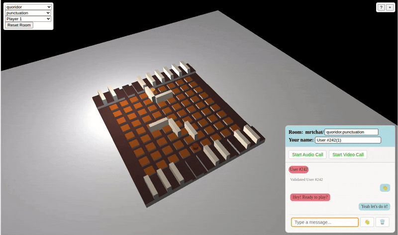
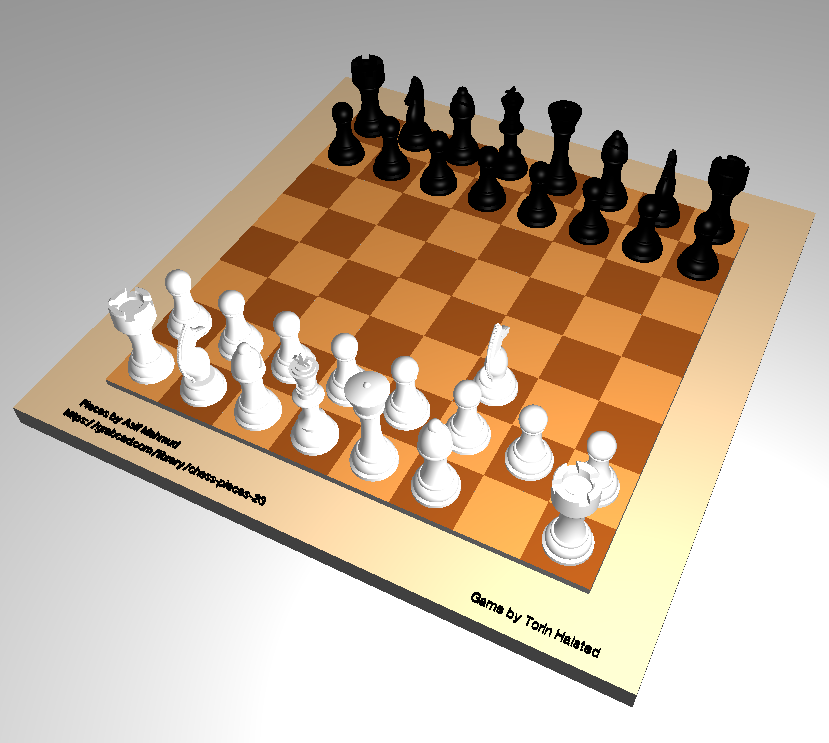

# Gameboard

**A serverless, multiplayer 3D board game platform with zero game-specific code.**

Gameboard is a THREE.js-powered web application that renders multiplayer board games entirely from JSON configuration files. 
Built with a spin-off sister repo [RTChat](https://github.com/modularizer/rtchat), it uses **public MQTT brokers and STUN servers** to establish peer-to-peer WebRTC connections, enabling real-time multiplayer gaming without a backend server.





**🎯 [Play Now](https://modularizer.github.io/gameboard#quoridor.punctuation.p1)** | **Sister Project:** [RTChat](https://github.com/modularizer/rtchat)

---

## 🌟 Features

- 🌐 **Completely Serverless**: No backend is used, no server, no databse - uses only public MQTT/STUN server for signaling (~3kB/connection)
- 💾 **Browser-based Persistence**: Game states get saved in your browser and synced with the rest of the room when other members join
- ⚡ **Real-time Multiplayer**: WebRTC peer-to-peer connections with automatic state synchronization
- 💬 **Live Text, Audio, & Video Group Chat**: WebRTC peer-to-peer connections let you talk as you play
- 🎨 **3D Graphics**: Powered by THREE.js with support for OBJ models, procedural shapes, and textures
- 🎮 **Universal Game Engine**: Chess, Quoridor, Scrabble, Ticket to Ride - all use the same code
- 📝 **Zero Game Logic**: All games defined purely through JSON config files which define images, 3D object files, and a configuration for how to setup our THREE.js environment
- 🏗️ **Declarative Templates**: JSON templates with loops, aliases, and inheritance
- 👥 **Player Roles**: Support for multiple players, observers (public/omniscient), and spectators
- 📊 **Built-in Scorecard**: Configurable scorekeeping with real-time sync, but the scoreboard UI needs a lof of work...

---

## 🎲 Add Your Own Game!

Want to create your own board game? **No programming required!** 
Games are defined entirely through JSON configuration files.

Notes:
- There is no rule enforcement aside from where pieces snap to on the board
- You CAN have
  - randomized draw piles
  - "hand" regions where the faces of the cards are only visible to the player holding them


### Quick Start
1. Fork this repo
2. Create `/assets/games/yourgame/spec.json`
3. Define your board, pieces, and rules in JSON
4. Add game name to `/src/js/config.js`
5. Push your code and enable GitHub Pages
6. Play at https://your-name.github.io/gameboard/#your-game.punctuation.p1
7. email [modularizer@gmail.com](mailto:modularizer@gmail.com) with questions or suggestions

**[📖 Read the Complete Guide →](ADDING_GAMES.md)**

### What You Can Build

- ♟️ **Board Games** - Chess, Checkers, Go
- 🃏 **Card Games** - Poker, Uno, Trading cards
- 🎲 **Dice Games** - Yahtzee, Farkle
- 🧩 **Puzzle Games** - Sliding puzzles, Tangrams
- 🗺️ **Territory Games** - Risk, Catan-style games

All using the same universal engine with zero game logic!

---

## 🎲 How It Works

### 📑 Table of Contents

| **Getting Started** | **Technical Deep Dive** | **Resources** |
|:-------------------|:-----------------------|:-------------|
| [🌟 Features](#-features) | [🎲 How It Works](#-how-it-works) | [📝 Example Config](#-example-minimal-game-config) |
| [🎲 Add Your Own Game](#-add-your-own-game) | [📄 JSON Configuration](#-json-configuration-system) | [🤝 Contributing](#-contributing) |
| [🚀 Getting Started](#-getting-started) | [🔧 Technical Details](#-technical-details) | [📜 License](#-license) |
| [🎮 Supported Games](#-supported-games) | [🔐 Security & Privacy](#-security--privacy) | [🔗 Links](#-links) |

---

### Architecture Overview

Gameboard is a **game-agnostic rendering and networking engine**. Here's the magic:

```
JSON Config → Model Loader → THREE.js Scene → RTChat Sync → WebRTC Peers
```

1. **JSON Configuration** defines the entire game (board, pieces, snap points, camera angles)
2. **Model Loader** interprets JSON and creates THREE.js objects
3. **Scene Manager** handles rendering, interactions, and state management
4. **RTChat Integration** syncs moves across all players via WebRTC
5. **No Game Logic** - movement rules, win conditions, and gameplay are emergent from the physical constraints

### Networking with RTChat

Gameboard leverages **RTChat**, a serverless WebRTC communication library that enables peer-to-peer connections through:

1. **MQTT Signaling**: Players join a "room" by subscribing to a shared MQTT topic
2. **STUN/ICE Exchange**: Public STUN servers facilitate NAT traversal and WebRTC handshake
3. **Direct P2P Connection**: Once established, all game moves travel directly between browsers
4. **Cryptographic Validation**: RSA-PSS challenge/response ensures peer identity
5. **End-to-End Encryption**: WebRTC encrypts all game data in transit

#### Event Flow

When a player moves a piece:

```javascript
// Player A moves a chess piece
scene.sendItemUpdate({
  "whiteKnight": { 
    position: [2, 1, 4],
    rotation: [0, 3.14, 0]
  }
});

// ↓ Sent via WebRTC data channel

// Player B receives update
scene.receiveItemUpdate(data, sender) {
  // Update local THREE.js scene
  item.setPosition(...data.position);
  item.pivot.rotation.set(...data.rotation);
  // Cache to localStorage
  localStorage.setItem(hash, JSON.stringify(data));
}
```

**Key Network Events:**
- `moves` - Position/rotation updates for game pieces
- `sync` - Full state synchronization for new joiners
- `score` - Scorecard updates
- `selected`/`unselected` - Visual feedback for which pieces others are touching
- `reset` - Reset game to initial state

### The THREE.js Rendering Pipeline

Gameboard uses THREE.js for all rendering, with a **universal scene manager** that works for any game:

```javascript
// From chess/spec.json
{
  "templates": {
    "piece": {
      "src": "GAME/knight.obj",    // 3D model path
      "position": { "x": 2, "y": 1, "z": 4 },
      "rotation": { "y": 3.14 },
      "moveable": true,             // Can players move it?
      "snap": "2x2",                // Snap to grid
      "metadata": { "side": "white", "type": "knight" }
    }
  }
}
```

The scene manager handles:
- **Raycasting** for click detection
- **Orbit controls** for camera manipulation
- **Snap controllers** for grid alignment
- **Drag/rotate** interactions
- **Zone detection** (dropzones, movezones)

---

## 📄 JSON Configuration System

Every game is **100% declarative**. Here's how it works:

### Basic Structure

```json
{
  "scene": {
    "camera": { "position": { "x": 15, "y": 20, "z": 15 } },
    "renderer": { "shadows": true }
  },
  "snaps": {
    "2x2": {
      "y": 1,
      "step": 2,
      "offset": 0.25,
      "lockedAxis": "y"
    }
  },
  "templates": { /* Reusable piece definitions */ },
  "repeatedModels": { /* Loops for creating multiple pieces */ },
  "models": { /* Actual game pieces */ }
}
```

### Template System

Templates support **variable substitution** and **inheritance**:

```json
{
  "templates": {
    "piece": {
      "src": "GAME/$name.obj",
      "color": "$$sideColor",
      "position": { "x": "$x", "y": 1, "z": "$z" }
    },
    "whitePawn": {
      "template": "piece",
      "name": "pawn",
      "side": "white",
      "z": 4
    }
  }
}
```

- `$variable` - Single substitution
- `$$variable` - Alias lookup
- `$$$variable` - Nested alias lookup

### Repeated Models (Loops)

Generate multiple pieces with ranges or arrays:

```json
{
  "repeatedModels": {
    "whitePawn$i": {
      "template": "whitePawn",
      "x": {
        "start": -8,
        "stop": 6,
        "step": 2
      }
    }
  }
}
```

This creates: `whitePawn0`, `whitePawn1`, ..., `whitePawn7` at x positions -8, -6, -4, -2, 0, 2, 4, 6.

### Model Sources

Gameboard supports multiple model types:

```json
// 3D Model (OBJ)
{ "src": "GAME/knight.obj" }

// Procedural Cube
{ 
  "src": { 
    "top": "#8B4513",
    "dimensions": { "width": 2, "height": 0.5, "depth": 2 }
  }
}

// Cylinder
{
  "src": {
    "top": "#FFD700",
    "dimensions": { "radius": 1, "height": 0.25 }
  }
}

// Text
{
  "src": { 
    "text": "Player 1",
    "size": 0.5
  }
}
```

### Snap Controllers

Define how pieces align to the board:

```json
{
  "snaps": {
    "2x2": {
      "y": 1,                    // Fixed Y position
      "step": 2,                 // Grid size
      "offset": 0.25,            // Grid offset
      "lockedAxes": ["y"],       // Position locks
      "rotationNodes": "grid"    // Rotation snap points
    }
  }
}
```

### Player-Specific Configs

Customize views per player:

```json
{
  "scene": {
    "camera": {
      "position": {
        "players": {
          "p1": { "x": 25, "y": 50, "z": -40 },
          "p2": { "x": 25, "y": 50, "z": 40 }
        }
      }
    }
  }
}
```

---

## 🎮 Supported Games

All games use the **exact same JavaScript codebase**. Only the JSON differs:

| Game | Pieces | Special Features |
|------|--------|------------------|
| **Chess** | 32 pieces | 8x8 snap grid, rotation snap |
| **Quoridor** | 20 walls + 4 pawns | Player-specific cameras |
| **Scrabble** | 100 tiles + board | Letter metadata, tile racks |
| **Ticket to Ride** | Cards + trains | Color coding, drop zones |
| **Cube** | Demo cube | Animation loops |

### Adding a New Game

1. Create `/assets/games/mygame/` directory
2. Add 3D models (`.obj` files) if needed
3. Create `spec.json` with templates and models
4. Add game name to `gameNames` array in `gameboard.js`
5. Done! No code changes required.

---

## 🚀 Getting Started

### Play Online

Visit **[modularizer.github.io/gameboard](https://modularizer.github.io/gameboard)**

### Local Development

```bash
git clone https://github.com/modularizer/gameboard.git
cd gameboard
npm install

# Serve locally (any HTTP server works)
npx http-server -p 8080

# Build minified bundle
node build.js
```

### Project Structure

```
gameboard/
├── assets/
│   └── games/
│       ├── chess/
│       │   ├── spec.json          # Game configuration
│       │   ├── pawn.obj           # 3D models
│       │   └── knight.obj
│       ├── quoridor/
│       └── ...
├── src/
│   ├── js/
│   │   ├── gameboard.js          # Main game controller
│   │   ├── scene.js              # THREE.js scene manager
│   │   ├── moveable.js           # Interaction handlers
│   │   └── components/
│   │       ├── model.js          # JSON → THREE.js loader
│   │       ├── cube.js           # Procedural shapes
│   │       └── 3d_model.js       # OBJ loader
│   └── css/
│       └── style.css
├── index.html                     # Entry point
└── build.js                       # Build script
```

---

## 🔧 Technical Details

### Dependencies

- **THREE.js** (v0.132.2) - 3D rendering engine
- **RTChat** - WebRTC/MQTT networking layer
- **MQTT.js** - MQTT client for signaling
- **Zero runtime dependencies** beyond CDN imports

### State Management

Gameboard maintains three state representations:

1. **Fresh State** - Initial game configuration from JSON
2. **Full State** - Current positions/rotations of all pieces
3. **State Diff** - Delta from fresh state (for efficient sync)

```javascript
// State synchronization
freshState = { knight: { position: [0,1,0], rotation: [0,0,0] } }
fullState  = { knight: { position: [2,1,4], rotation: [0,3.14,0] } }
diff       = { knight: { position: [2,1,4], rotation: [0,3.14,0] } }

// New player joins → receives diff → applies to fresh state
```

### Interaction Modes

- **Click & Drag** - Move pieces with mouse
- **Arrow Keys** - Precise positioning
- **Right-click Drag** - Free rotation
- **Double-click** - Snap rotate (90° by default)
- **Spacebar** - Rotate while selected

### Browser Compatibility

- Chrome/Edge ✅
- Firefox ✅
- Safari ✅ (WebRTC supported)
- Mobile browsers ✅ (touch controls)

---

## 🔐 Security & Privacy

Gameboard inherits RTChat's **intentionally serverless** design:

⚠️ **Trade-offs:**
- ✅ No server means no hosting costs, no downtime, no data storage
- ⚠️ Exposes metadata (IP addresses, room names) over public MQTT during signaling
- ✅ WebRTC connections are end-to-end encrypted after handshake
- ✅ RSA-PSS identity verification prevents impersonation

**See [RTChat Security](https://github.com/modularizer/rtchat/blob/main/SECURITY.md) for details.**

---

## 📝 Example: Minimal Game Config

```json
{
  "scene": {
    "camera": { "position": { "x": 10, "y": 10, "z": 10 } }
  },
  "snaps": {
    "grid": { "y": 1, "step": 2 }
  },
  "models": {
    "board": {
      "src": { 
        "top": "#8B4513",
        "dimensions": { "width": 10, "height": 0.5, "depth": 10 }
      },
      "position": { "x": 0, "y": 0, "z": 0 },
      "moveable": false
    },
    "piece": {
      "src": "GAME/piece.obj",
      "position": { "x": 0, "y": 1, "z": 0 },
      "moveable": true,
      "snap": "grid"
    }
  }
}
```

Save to `/assets/games/mygame/spec.json` and it's playable!

---

## 🤝 Contributing

Want to contribute, fork, or have questions? 

Contact me at [modularizer@gmail.com](mailto:modularizer@gmail.com)


---

## 📜 License

This is free and unencumbered software released into the public domain. See [LICENSE](LICENSE) for details.

**TL;DR:** Do whatever you want with this code. No attribution required.

---

## 🙏 Credits

- **RTChat** - Serverless WebRTC networking by [@modularizer](https://github.com/modularizer)
- **THREE.js** - 3D graphics library by [mrdoob](https://github.com/mrdoob)
- **Chess pieces** - 3D models by [Asif Mahmud](https://grabcad.com/library/chess-pieces-23)

---

## 🔗 Links

- **Live Demo**: [modularizer.github.io/gameboard](https://modularizer.github.io/gameboard)
- **RTChat Live Demo**: [modularizer.github.io/rtchat](https://modularizer.github.io/rtchat)
- **RTChat Repo**: [github.com/modularizer/rtchat](https://github.com/modularizer/rtchat)
- **THREE.js Docs**: [threejs.org/docs](https://threejs.org/docs)

